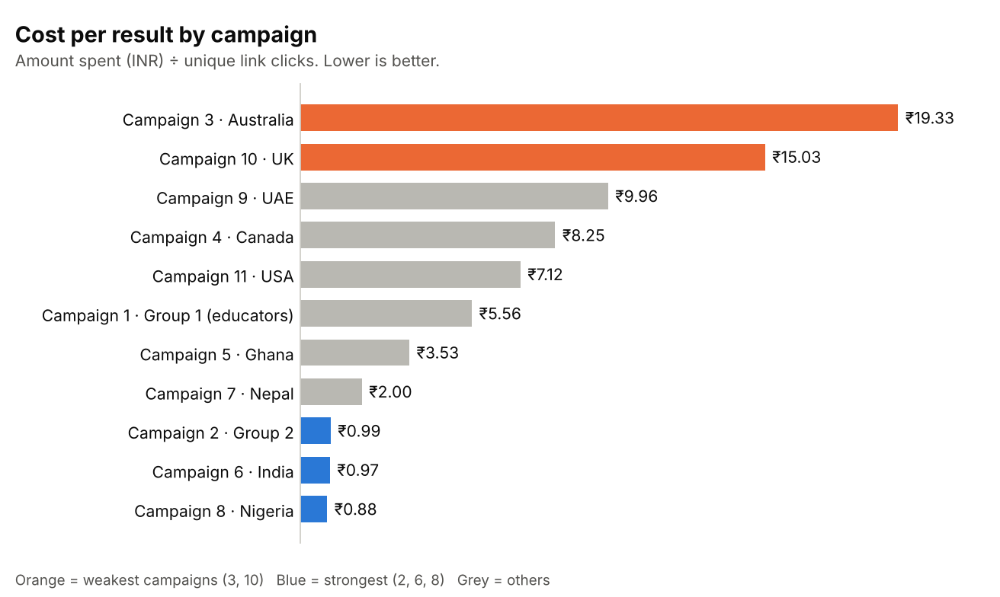
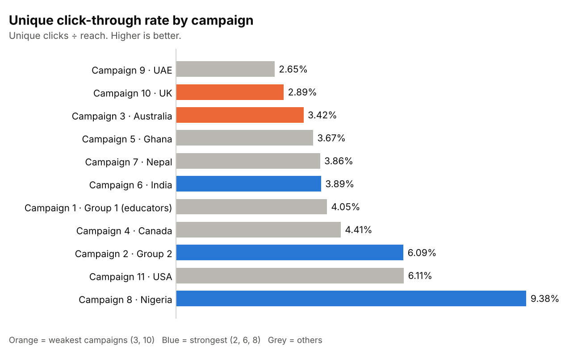

# Superhero U Ad Campaign Analysis

## 📌 Project Overview
**Superhero U** is a competition run by **GlobalShala** to inspire innovation and inventiveness among young people, guided by the UN mission to "promote prosperity while protecting the planet". The competition was promoted with **11 Facebook ad campaigns** (basic image "Link Click" ads) aimed at two audiences: **students** in different countries and **educators and principals**.

This group project (team of 9) analyses how each campaign performed on cost and engagement, to decide **which campaigns to discontinue, which to keep and where the budget works hardest**. My role on the team was **Analysis and Planning**.

---

## 🛠️ Tools & Technologies
- **Spreadsheet software**: Pivot tables, calculated metrics and charts
- **Microsoft PowerPoint**: Team presentation of the findings

---

## 📁 Data Source
- **File**: `Superhero_U_Campaign.xlsx` 
- **Records**: 33 rows, one per campaign and age group
- **Campaigns**: 11, in 11 geographies (Group 1, Group 2, Australia, Canada, Ghana, India, Nepal, Nigeria, UAE, UK, USA)
- **Audiences**: Students (Campaigns 2–11) and Educators and Principals (Campaign 1)
- **Age groups**: 13–17, 18–24, 25–34, 35–44, 45–54, 55–64
- **Fields**: Reach, Impressions, Frequency, Clicks, Unique Clicks, Unique Link Clicks, CTR, Unique CTR, Amount Spent (INR), Cost per Click, Cost per Result
- **Currency**: all costs are in **Indian rupees (₹)**

---

## 🧹 Data Cleaning & Preparation
- Checked the data: no missing values and no duplicate rows
- Verified the supplied metrics against the raw columns:
  - **CPC** = Amount Spent ÷ Clicks
  - **CPR (Cost per Result)** = Amount Spent ÷ Unique Link Clicks. A **result** is a unique click-through to the Superhero U website
  - **CTR** = Clicks ÷ Impressions
  - **Unique CTR** = Unique Clicks ÷ Reach
- Calculated **campaign-level** metrics from summed totals (for example, total spend ÷ total unique link clicks). Averaging or adding up the age-group ratios would give misleading results, because campaigns have different numbers of age groups and audience sizes
- Added **Cost per Unique Click** = Amount Spent ÷ Unique Clicks

---

## 📊 Exploratory Data Analysis (EDA)

### 💵 Overall Campaign Metrics
- **Total spend**: ₹12,088.61
- **Reach**: 188,868 | **Impressions**: 289,860
- **Clicks**: 12,025 | **Unique clicks**: 9,504 | **Unique link clicks (results)**: 5,257
- **Overall cost per result**: ₹2.30 | **Cost per click**: ₹1.01 | **CTR**: 4.15%

### 📣 Campaign Performance
| Campaign | Audience / Geography | Reach | Spend (₹) | Results | Cost per click (₹) | Cost per result (₹) | Unique CTR |
|---|---|---|---|---|---|---|---|
| 1 | Educators and Principals / Group 1 | 23,904 | 2,333.33 | 420 | 1.92 | 5.56 | 4.05% |
| 2 | Students / Group 2 | 46,494 | 1,579.02 | 1,595 | 0.42 | 0.99 | 6.09% |
| 3 | Students / Australia | 3,187 | 850.68 | 44 | 7.15 | **19.33** | 3.42% |
| 4 | Students / Canada | 3,307 | 923.96 | 112 | 5.40 | 8.25 | 4.41% |
| 5 | Students / Ghana | 15,024 | 837.78 | 237 | 1.29 | 3.53 | 3.67% |
| 6 | Students / India | 31,831 | 955.21 | 987 | 0.68 | 0.97 | 3.89% |
| 7 | Students / Nepal | 29,668 | 1,035.24 | 518 | 0.73 | 2.00 | 3.86% |
| 8 | Students / Nigeria | 21,929 | 942.78 | 1,073 | 0.34 | **0.88** | **9.38%** |
| 9 | Students / UAE | 7,333 | 876.26 | 88 | 3.62 | 9.96 | **2.65%** |
| 10 | Students / UK | 3,636 | 856.67 | 57 | 7.08 | 15.03 | 2.89% |
| 11 | Students / USA | 2,555 | 897.68 | 126 | 5.04 | 7.12 | 6.11% |

### 🎂 Age Groups
| Age group | Reach | Spend (₹) | Results | Cost per result (₹) |
|---|---|---|---|---|
| 13–17 | 45,665 | 3,258.30 | 1,304 | 2.50 |
| 18–24 | 101,035 | 4,952.19 | 3,103 | **1.60** |
| 25–34 | 29,651 | 2,637.03 | 610 | 4.32 |
| 35–44 | 8,761 | 835.46 | 154 | 5.43 |
| 45–54 | 2,867 | 319.38 | 65 | 4.91 |
| 55–64 | 889 | 86.25 | 21 | 4.11 |

### 🎯 Audiences
| Audience | Reach | Spend (₹) | Results | Cost per result (₹) |
|---|---|---|---|---|
| Students | 164,964 | 9,755.28 | 4,837 | 2.02 |
| Educators and Principals | 23,904 | 2,333.33 | 420 | 5.56 |

---

## 📈 Key Insights & Analysis

### 🔻 Weakest Campaigns: 3 (Australia) and 10 (UK)
- Highest **cost per result** (₹19.33 and ₹15.03) and highest **cost per click** (₹7.15 and ₹7.08)
- Highest **cost per unique click** (₹7.80 and ₹8.16)
- Together they took **14.1% of spend** but delivered only **1.9% of results** (101 of 5,257)
- Campaign 3 costs about **22 times more per result** than Campaign 8

### 🔺 Strongest Campaigns: 8 (Nigeria), 6 (India) and 2 (Group 2)
- Lowest cost per result (₹0.88, ₹0.97 and ₹0.99) and lowest cost per click
- Together they took **28.8% of spend** and delivered **69.5% of results** (3,655)
- **Campaign 8** also has the highest unique click-through rate (**9.38%**), well ahead of the rest

### ⚠️ Campaign 9 (UAE)
- Lowest unique click-through rate of all campaigns (**2.65%**)
- Third-highest cost per result (₹9.96) and fifth-highest cost per click (₹3.62)
- Its spend (₹876.26) is similar to Campaigns 3 and 10, so its weak results are not explained by a small budget

### 🌍 Geography
- The five most expensive campaigns per result (Australia, UK, UAE, Canada, USA) all target higher-income markets
- They also had small audiences (reach of 2,555 to 7,333), while Nigeria, India, Nepal and Group 2 reached 21,929 to 46,494 people on similar budgets

### 👥 Age and Audience
- **18–24-year-olds** are the most efficient group: 53.5% of reach, 41.0% of spend and **59.0% of results**, at ₹1.60 per result
- Every group aged 25 and over costs ₹4.11 to ₹5.43 per result, roughly 2.6 to 3.4 times the 18–24 rate
- **Educators and Principals** cost ₹5.56 per result, about 2.8 times the student rate (₹2.02)

---

## 🧩 Visuals

---

## ✅ Recommendations

### 1. Discontinue Campaigns 3 and 10
- They use 14.1% of spend for 1.9% of results

### 2. Move Budget to Campaigns 8, 6 and 2
- Increase spend gradually and track cost per result, because costs can rise as audiences become saturated

### 3. Keep Campaign 9 Under Review
- Test new creative or targeting. If cost per result and click rate do not improve, pause it

### 4. Prioritise Students Aged 18–24
- This group delivers the most results at the lowest cost

### 5. Test New Messaging for Educators and Principals
- Results cost almost three times as much as for students, so try different ads before increasing spend

---

## ⚠️ Limitations
- **No dates** in the data, so trends over time cannot be analysed
- A **result** is a unique link click to the website. There is no data on registrations or competition entries, so the analysis shows click efficiency, not final return on spend
- Some audiences are **small** (Campaign 11 reached 2,555 people; Campaign 3 reached 3,187), so their rates may be less stable
- Campaigns target different countries and audience sizes, so differences also reflect market conditions
- Spend per campaign was similar (₹838 to ₹1,035) apart from Campaigns 1 and 2, so the data cannot show how results change at higher budgets
- Single snapshot of one competition's campaigns

---

## 📌 Conclusion
Across 11 campaigns and ₹12,088.61 of spend, results were uneven. **Campaigns 3 (Australia) and 10 (UK)** were the least efficient and should be discontinued, while **Campaigns 8 (Nigeria), 6 (India) and 2 (Group 2)** delivered about 70% of all results for under 30% of the spend. **Campaign 9 (UAE)** also performed poorly on click rate and cost per result and needs review. Students aged 18–24 were the most cost-effective audience. Shifting budget toward the strongest campaigns and audiences would increase the number of people reaching the Superhero U website for the same spend.

---

## 📁 Additional Assets
- 📊 Campaign data and charts: `Superhero_U_Campaign.xlsx`
- 🖥️ Team presentation: `Superhero_U_Campaign_Presentation.pptx`

---

> 📬 *Feel free to reach out if you'd like help building a dashboard, SQL queries, or a presentation deck!*
